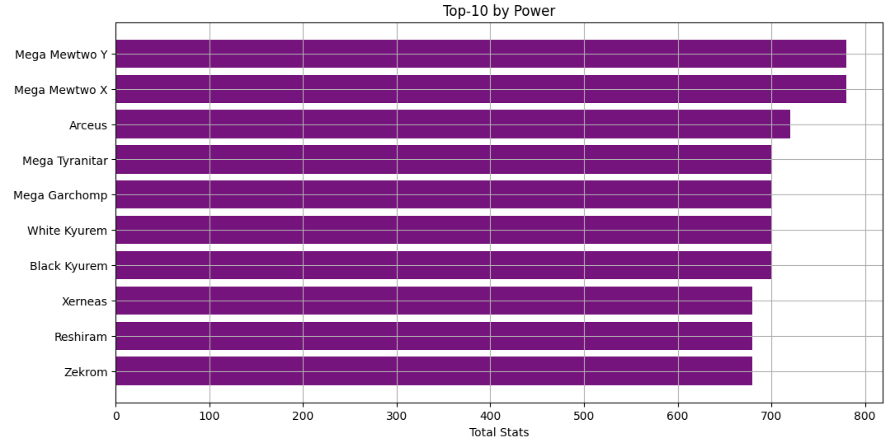

# PokeStats: Pokemon Data Analysis 📈

## About

This project analyzes Pokemon data using Python and Jupyter Notebook.  
The goal is to clean the data, create new features like "Total Stats" and "Speed Category," and visualize key insights such as attack vs defense and speed distributions.

## Project Structure

```
pokestats/
├── data/
│   └── pokemon.xlsx          # Raw data
├── notebooks/
│   └── PokeCode.ipynb   # Jupyter Notebook with cleaning and visualizations
├── README.md                 # Project description
```


## Technologies Used

- Python 3
- Pandas
- Matplotlib
- Jupyter Notebook
- Tableau Public

## How to Run

1. Open `PokeCode.ipynb` in Jupyter Notebook.
2. Run all cells sequentially.
3. View the generated visualizations.

## Key Features

- Data cleaning and duplicate removal
- Creating a "Total Stats" feature by summing major Pokemon characteristics
- Speed categorization: Fast, Average, Slow
- Visualizations:
  - Total Stats distribution
  - Attack vs Defense scatter plot
  - Top 10 Pokemon by overall strength

## Visualization

<p align="center">
  
  
</p>

## Top-10 Pokemons



## Key Insights

- Most Pokemons have moderate total stats (~400-500), with few reaching 600+.
- Attack vs Defense analysis shows that few Pokemon are extremely strong in both.
- Speed categorization helps distinguish between fast sweepers and defensive tanks.
- Legendary Pokemon significantly outperform non-legendary ones across all attributes.


## 🌟 Explore the Interactive Dashboard

[PokeInsight: Pokemon Stats Dashboard](https://public.tableau.com/app/profile/mariia.maslova/viz/PokeStatsDashboard-4/FinalDashboard?publish=yes)

This dashboard provides a comprehensive exploration of Pokemon statistics:
- Key performance indicators such as Top Pokemon, Average Attack, and Average Speed
- Top 10 strongest Pokemon visualized in a bar chart
- Attack vs Defense scatter plot to analyze strategic profiles
- Speed trends across different Pokemon types
- Interactive filters by Pokemon Type, Speed Category, and Generation

Built with Tableau Public.

## Author

Created by Mariia Maslova
